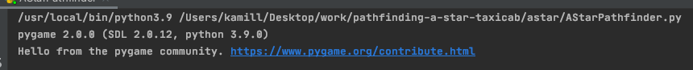
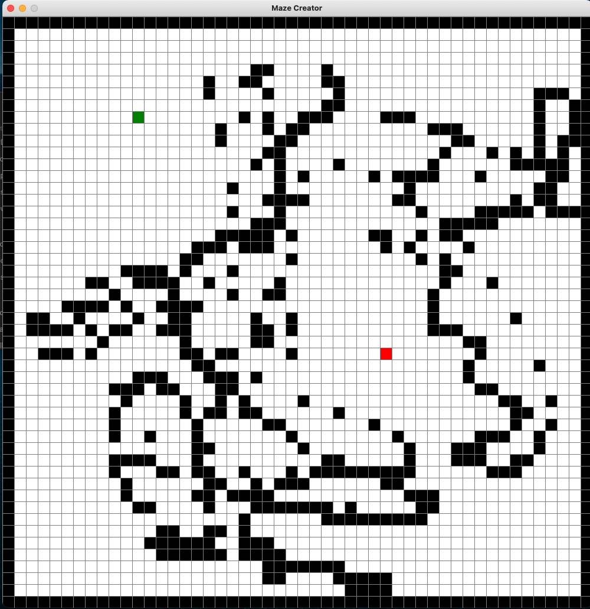
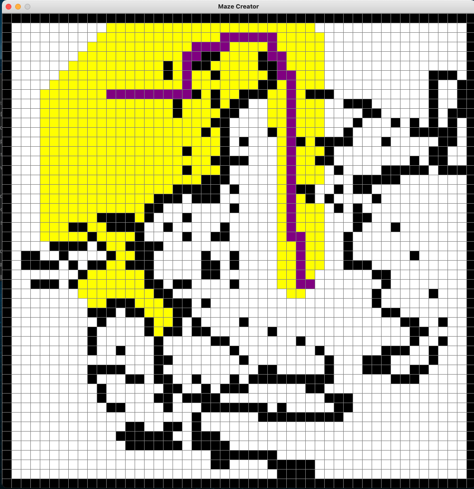
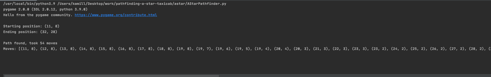

# pathfinding-a-star-chebyshev
Simple implementation of A* (A Star) pathfinding algorithm.  
https://en.wikipedia.org/wiki/A*_search_algorithm

# heuristic function (or in human - approximate)
Chebyshev distance
https://en.wikipedia.org/wiki/Chebyshev_distance

# pseudocode

# running the pathfinder
To run the pathfinder run the astar/AStarPathfinder.py file

- create maze

-press ENTER to export grid
-pathfinding result

-you can also inspect the moves that were made (including starting and ending pos)

# YouTube
https://www.youtube.com/watch?v=5G1JL9vHpyM

# ENJOY
